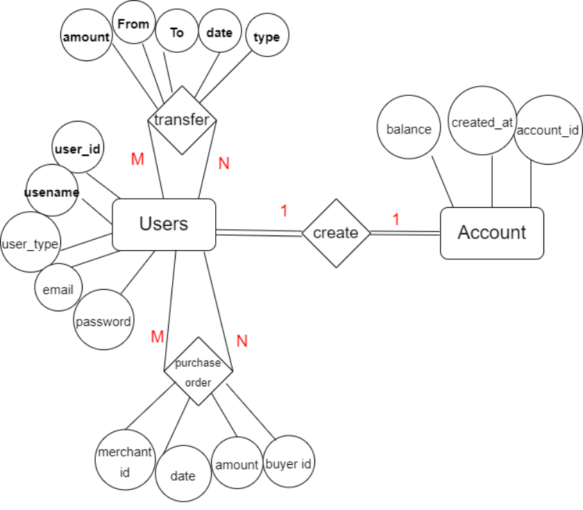
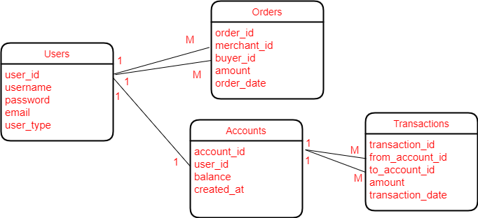

## Online Banking System Project

---
---
### Project Functionality

---

The Online Banking System provides essential banking functionalities, enabling clients to create accounts, transfer money, and make online purchases.

Project Functionality

1- **Account Creation**: Clients can register and create personal or merchant accounts.
    (client can create only one account)

2- **Money Transfers**: Clients can transfer money to other clients within the system.

3- **Online Purchases**: Merchant clients can sell products online, and regular clients can purchase these products.

4- **Account Details**: Users can view their account information, including transaction history and balance.

---

### Database Design

---
My first priority will be establishing an effective database design to lay a solid groundwork for managing and ensuring the integrity of project data.

## **1- Gathering Requirements:** 
- Each user will have a unique account 
- User can be an online store
- Users can transfer money to each other
- User can purchase from the registered online stores 

## **2- DBMS selection:**
Using a relational database for this scenario offers several advantages:
- #### Data Integrity

    Relational databases enforce data integrity through constraints such as primary keys, foreign keys, and unique constraints. This ensures that the data remains accurate and consistent. For example, a foreign key constraint can ensure that transactions reference valid accounts.

- #### Structured Data

    Relational databases are ideal for structured data. In this scenario, user accounts, transactions, orders, and account details all have a well-defined structure that fits naturally into tables with rows and columns.
- #### ACID Properties

    Relational databases adhere to ACID (Atomicity, Consistency, Isolation, Durability) properties, which are crucial for financial transactions

        

- #### Complex Queries and Joins

    Relational databases are optimized for complex queries and joins. This allows for efficient retrieval of related data, such as fetching a user's transaction history or summarizing account balances.

## **3- Analysis:**
#### From requirements to ER diagram

## **4- logical design:**

#### ER-to-Relational mapping

## **5- Database creation:**

create the database in Microsoft SQL Server

SQL statements to create the database in database/schema.sql

